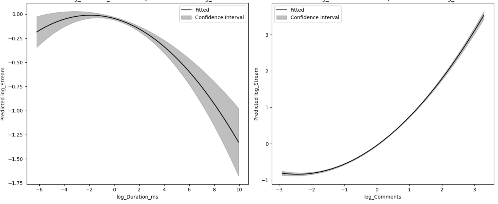
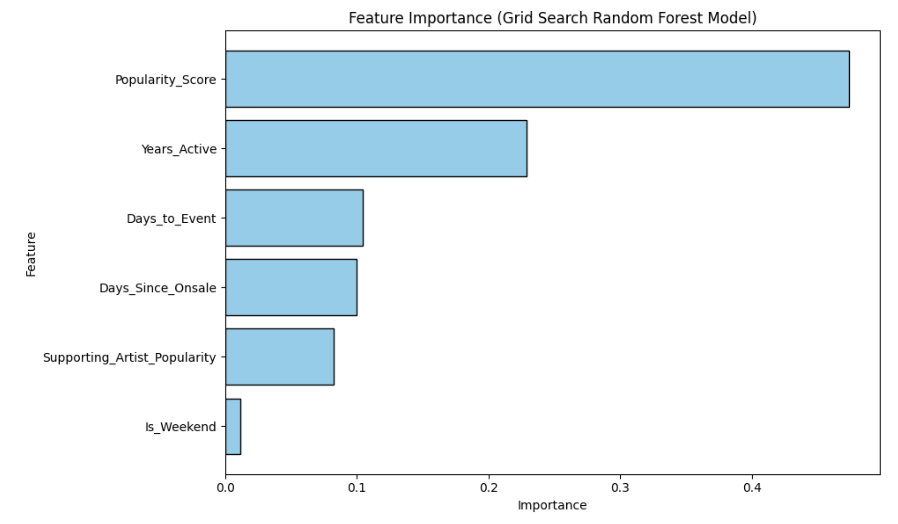
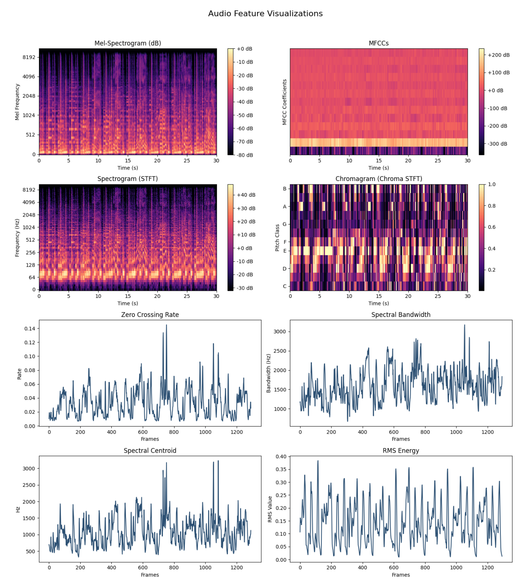
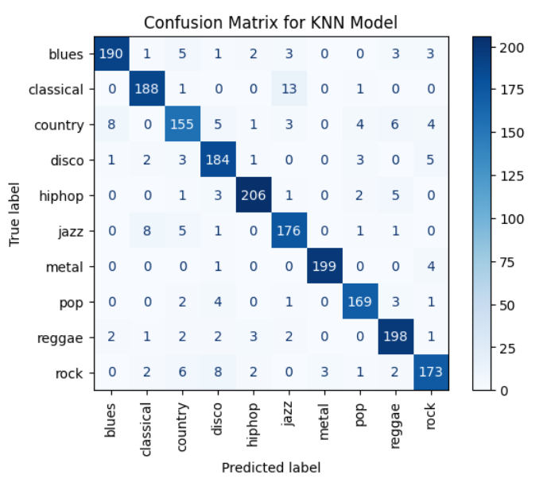
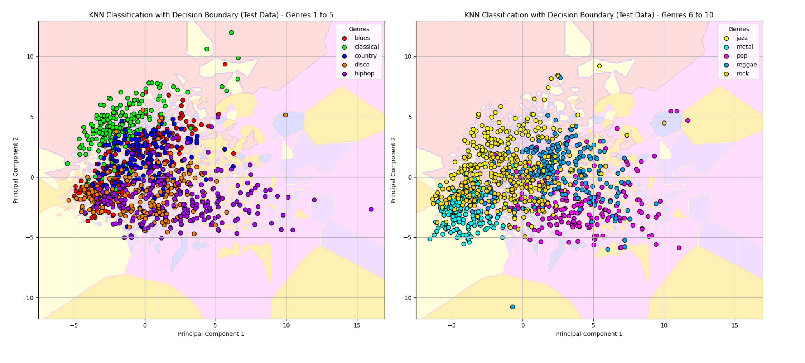
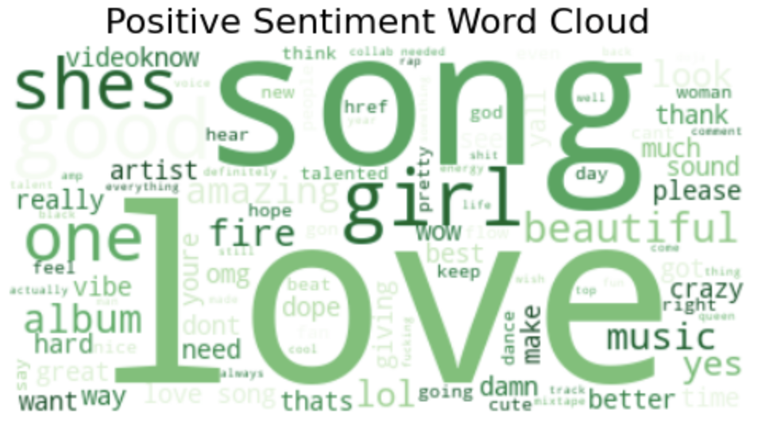
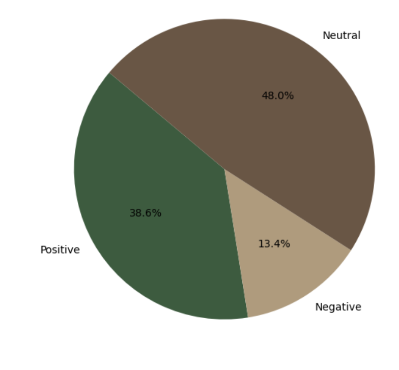

## PROJECTS

-----

  
<h3>Music Streams Prediction Model</h3>

This project analyzes Spotify and YouTube data to predict song popularity using a regression model. With over 20,000 records and 27 features, I identified key drivers like comments, acoustic attributes, and optimal duration through feature selection methods such as Boruta SHAP and VIF. The model incorporates interaction and non-linear terms to reveal nuanced relationships between musical features and engagement. Insights from this project support data-driven strategies for production, marketing, and playlist curation, empowering stakeholders to optimize audience engagement and streaming success.

  

    
<strong>Effect of Duration and Comments on Streams</strong>

    
  

  

    
<strong>Correlation Plot of Features</strong>

    
  

-----

<h3>Music Streams Prediction Calculator</h3>

The interactive Streams Prediction Calculator extends the prediction model's utility, allowing users to input song features and receive real-time streaming predictions through a cloud-hosted interface. This tool empowers music industry stakeholders to optimize production, marketing, and playlist strategies with data-driven insights.

  
<strong>Demo</strong>

  <video autoplay loop muted controls style="width: 60%; max-width: 300px; height: auto;">
    <source src="assets/Calc_demo.mov" type="video/quicktime">
    Your browser does not support the video tag.
  </video>

-----

<h3>Dynamic Concert Ticket Price Prediction Model</h3>

I created a custom dataset to train a predictive model for concert ticket pricing, incorporating factors like artist popularity, event timing, and supporting acts. Through analysis and model development, I identified key drivers of ticket prices and provided actionable insights into pricing strategies. Additionally, I developed a Dynamic Ticket Price Calculator, a user-friendly tool that allows users to input event details and receive instant price predictions. This project empowers stakeholders in the events industry to optimize revenue and enhance decision-making with data-driven strategies.

  

    
<strong>Demo</strong>

    <video autoplay loop muted controls style="width: 100%; height: auto;">
      <source src="assets/demo.mov" type="video/quicktime">
      Your browser does not support the video tag.
    </video>
  

  

    
<strong>Important Features</strong>

    
  

-----

<h3>Music Genre Classification Model</h3>

In this project, I built a machine learning model to classify songs into genres based on their audio features, such as tempo, rhythm, and frequency, which were extracted from audio files. I identified key characteristics that distinguish genres and trained a predictive model to achieve accurate classifications, showcasing the power of data-driven approaches in understanding and organizing music. This work has applications in music recommendation systems, playlist curation, and audience engagement strategies for the music industry.

  

    
<strong>Audio Feature Visualizations</strong>

    
  

  

    

      
<strong>Prediction Accuracy Matrix</strong>

      
    

    

      
<strong>Decision Boundaries</strong>

      
    

  

-----

<h3>YouTube Comments Sentiment Analysis</h3>

This project explores the sentiment behind audience reactions to YouTube videos in the music industry. Using the YouTube API, I extracted video metadata and comments, performed data cleaning, and built a machine learning model to classify comments as positive, neutral, or negative. I also conducted a regression analysis using sentiment scores and engagement metrics (likes, comments) to predict video view counts. This work provides actionable insights for optimizing content strategies and deepening audience connections for artists and industry stakeholders.

  

    
<strong>Word Cloud of Comments</strong>

    
  

  

    
<strong>Sentiment Distribution</strong>

    
  

-----

<h3>Automated Music Metrics Extraction</h3>

This project automates the tracking and analysis of music-related metrics across platforms. Using the YouTube Data API and Spotify Web API, metrics like views, likes, comments, subscriber counts, Spotify popularity, and follower data are extracted daily and stored in a centralized Google Sheet. Comment data, including timestamps and sentiment scores, is also collected for engagement analysis.

By streamlining data collection, this solution provides real-time updates and actionable insights for artists, managers, and stakeholders, enabling efficient performance evaluation, audience sentiment analysis, and trend identification across platforms.

  

    
<strong>Demo 1: Daily Metrics Tracker</strong>

    <video autoplay loop muted controls style="width: 100%; height: auto;">
      <source src="assets/top_videos.mov" type="video/quicktime">
      Your browser does not support the video tag.
    </video>
  

  

    
<strong>Demo 2: Comments Tracker</strong>

    <video autoplay loop muted controls style="width: 100%; height: auto;">
      <source src="assets/comments_track.mov" type="video/quicktime">
      Your browser does not support the video tag.
    </video>
  

---------

<h3>Tableau Dashboard for Payroll Operations, University of California</h3>

This project involved developing an automated, real-time Tableau dashboard that dynamically monitored tax forms and paycheck issuance for enhanced payroll decision-making. I designed a SQL-automated pipeline that fed live data into Tableau, utilizing dynamic filters to enable targeted analysis reports and generate actionable insights in real time. Additionally, I applied time series forecasting using Python’s <code>statsmodels</code> library (ARIMA) to predict future file volumes, aiding in optimized resource allocation and improved operational efficiency.

  <h4>Tableau Demo</h4>
  <video width="500" height="350" controls>
    <source src="assets/Tableau_Demo.mov" type="video/mp4">
    Your browser does not support the video tag.
  </video>

---------
